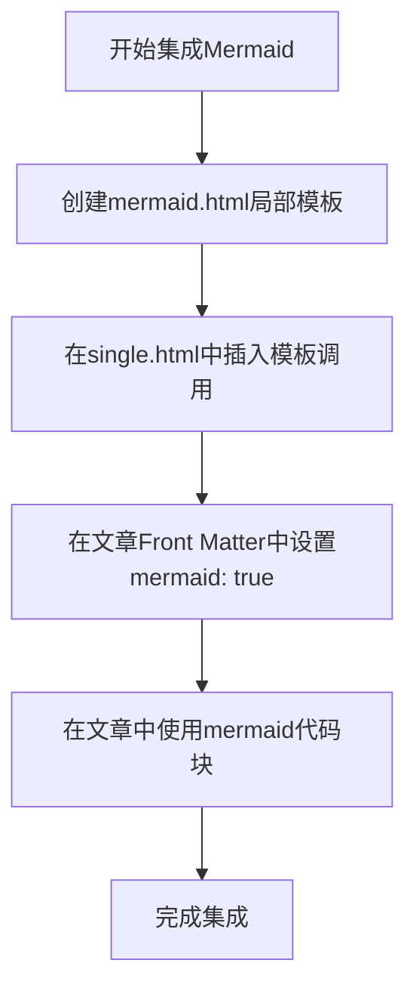

# 如何在hugo博客中添加mermaid支持

## 前言

对于很多hugo博客的主题，他们并没有直接填完关于mermaid语法的支持，这也就导致了我们制作的一些mermaid图表无法被渲染，可读性急剧下降。为此，为hugo添加mermaid支持就非常有必要了。

在很多博客里面，我们可以看到可以通过添加短代码的方式来实现添加mermaid支持，但是通过这种方式支持的mermaid需要在markdown文件中添加短代码语法，类似于这样：

```markdown

graph LR
    A[开始] --> B{思考}
    B -->|是| C[行动]
    B -->|否| D[放弃]

```

而不是：

````markdown
```markdown
graph LR
    A[开始] --> B{思考}
    B -->|是| C[行动]
    B -->|否| D[放弃]
```
````

这让页面组织会显得有点怪，而且这篇文章如果需要发到某些支持mermaid的markdown的平台上时就会产生混乱。

为此我们可以选择通过hugo的partial功能来实现这个效果。

## 创建局部模板文件

在`layouts/partials`目录下创建一个局部模板，我们将其命名为`mermaid.html`。

然后将以下代码填入其中：

```html
{{ if .Params.mermaid }}
<script type="module"> import('https://cdn.jsdelivr.net/npm/mermaid@11/dist/mermaid.esm.min.mjs')
        .then((mermaidModule) => {
            const mermaid = mermaidModule.default;
            mermaid.initialize({
                startOnLoad: true,
                theme: 'neutral'	// 可以修改主题
            });
            Array.from(document.getElementsByClassName("language-mermaid")).forEach((el) => {
                el.parentElement.outerHTML = `<div class="mermaid">${el.innerHTML}</div>`;
            });
            mermaid.init(undefined, '.mermaid');
        })
        .catch((error) => {
            console.warn('Mermaid 加载失败，图表将显示为代码块:', error);
        });
</script>
{{ end }}
```

现在，我们就拥有了mermaid模块了，可以将其添加在一个界面模板中，以供加载。

## 修改文章模板

将个人主题的文章模板`single.html`复制到根目录的`layouts/_default`文件夹中，然后在其中的合适位置，例如`{{ .Content}}`的下方，插入一行代码：

```html
{{- partial "mermaid.html" . -}}
```

这种先将文章模板复制再进行修改的方法，可以防止后来主题更新将我们的修改覆盖掉（相较于在主题文件里修改），同时也保证了原本主题的完整性（相较于不复制直接创建一个空白的`single.html`）。

## 按需启用

如果你需要在某一个文章中启用mermaid，只需要在这个文章的Front Matter中添加`mermaid: true`，以此来声明需要加载mermaid即可。

## 总结

通过这种方式，我们就实现了hugo博客对于mermaid的支持，本片博客就是通过这个方法实现的对mermaid的支持，以下是实现效果。



其实理论上，我们还可以用hooks来实现，但是我没有试验成功，所以就不在此赘述了。
